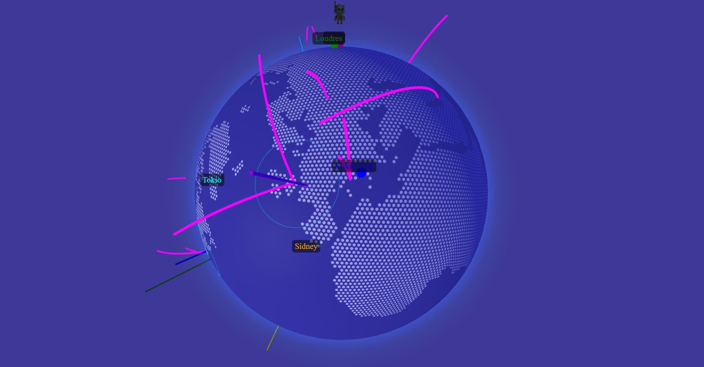

# Globo Interactivo muestra donde están ubicados los expertos de Prestashop

## Acceso Rápido a la Aplicación
[Visitar Aplicación](https://xococode.github.io/World3dPrestahop.github.io/)

## Descripción
Este proyecto presenta un globo interactivo en 3D que muestra la ubicación de los expertos de Prestashop, desarrollado con **Three.js** y **ThreeGlobe**. La aplicación renderiza un globo terráqueo que utiliza polígonos hexagonales para representar países, e integra animaciones de puntos, efectos ripple, trayectorias de vuelo y modelos 3D. Además, incorpora interactividad a través de controles de cámara y detección de marcadores con raycasting.

## Características

### Visualización 3D Interactiva
Renderizado de un entorno 3D inmersivo con iluminación ambiental y direccional, adaptado a dispositivos de escritorio y móviles.

### Polígonos Hexagonales
Representación de países mediante polígonos hexagonales basados en datos GeoJSON, ofreciendo un estilo moderno y dinámico.

### Animaciones y Efectos Visuales
- **Puntos Animados:** Cargados desde `randomPoints.json`, estos puntos varían su tamaño de forma dinámica.
- **Anillos Ripple:** Se aplican efectos de ondas expansivas utilizando shaders personalizados.

### Trayectorias de Vuelo Dinámicas
Visualización de rutas aéreas animadas, con datos cargados de `flightPaths.json` y `flightPaths1.json`.

### Marcadores y Etiquetas Interactivas
Se agregan marcadores en el globo con etiquetas y enlaces externos, que se activan mediante la detección de la posición del cursor.

### Modelo 3D
Integración de modelos 3D (GLB) que se posicionan y orientan correctamente en la superficie del globo, representando a los expertos de Prestashop.

### Controles de Navegación
Uso de `TrackballControls` para permitir la rotación, el zoom y la exploración interactiva del globo.
